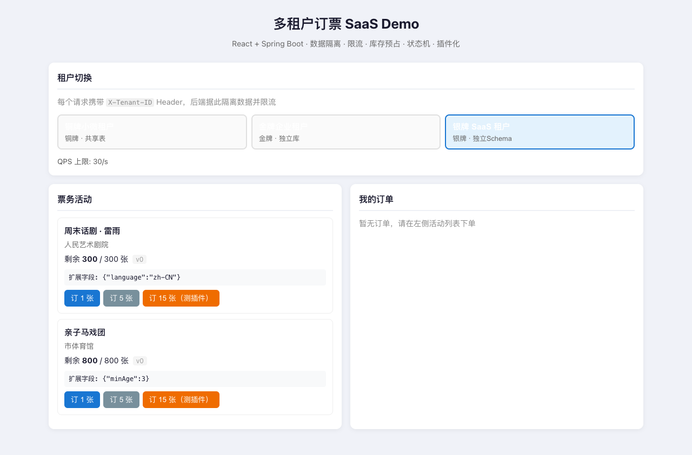
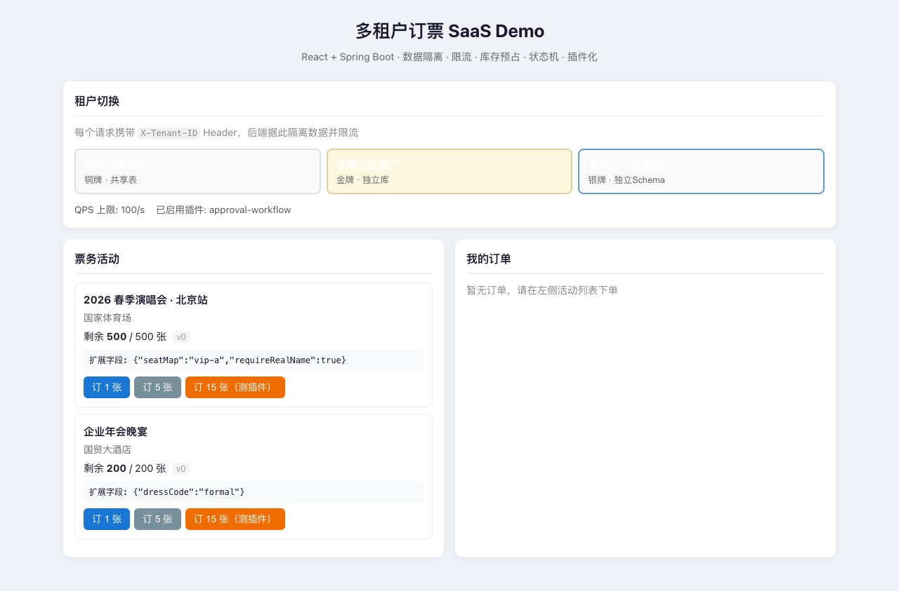
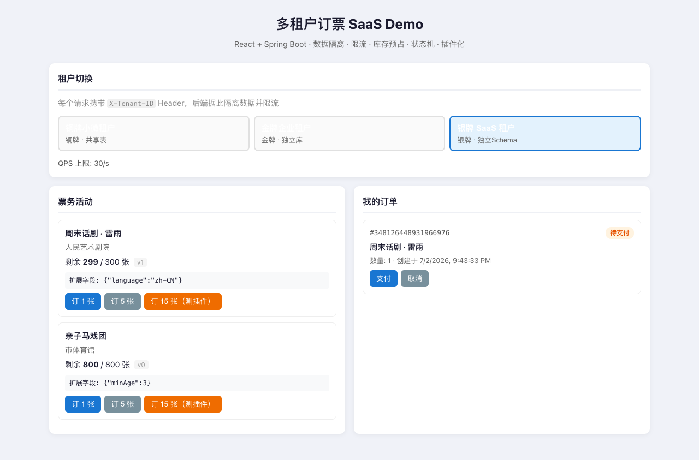
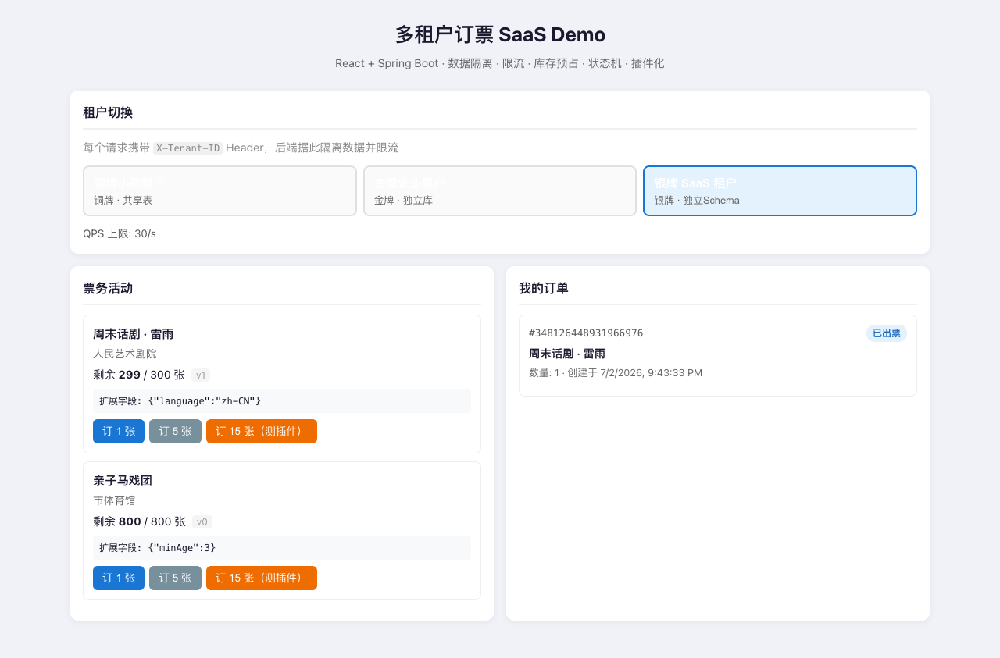
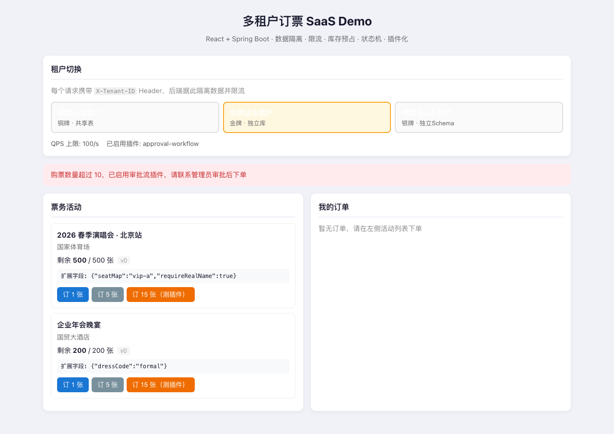

# 多租户订票 SaaS Demo

React + Spring Boot 全栈样例，演示多租户 SaaS 订票系统的核心架构设计要点（**不含 Spring AI**）。

> 仓库地址：[github.com/liweinan/ticket_demo](https://github.com/liweinan/ticket_demo)

架构风格参考 [my_ai_demo_proj](https://github.com/liweinan/springai_demo)：`controller → service → repository` 分层、Vite 代理、pnpm workspace。

**详细架构说明** → [docs/ARCHITECTURE.md](docs/ARCHITECTURE.md)

---

## 效果预览

| 银牌租户初始页 | 金牌租户活动 |
|:---:|:---:|
|  |  |

| 下单后（待支付） | 出票完成 |
|:---:|:---:|
|  |  |

| 审批流插件拦截（订 15 张） |
|:---:|
|  |

截图由 Playwright 自动生成：`pnpm capture-screenshots`（需先启动前后端）

---

## 设计要点一览

| 主题 | Demo 中的体现 |
|------|--------------|
| 数据隔离 | 共享表 + `tenant_id`；租户元数据声明三种隔离模式 |
| 租户识别 | `X-Tenant-ID` Header + `TenantContext` ThreadLocal 透传 |
| 防噪声邻居 | 金/银/铜租户不同 QPS 限流 |
| 库存扣减 | **Redis Lua 预占** + PostgreSQL CAS 乐观锁 |
| 持久化 | **PostgreSQL**（jsonb 扩展字段） |
| 订单状态机 | `OrderStateMachine` 集中管理合法变迁 |
| 分布式 ID | Snowflake 生成订单主键 |
| 租户定制 | JSON 扩展字段 + 插件化（审批流示例） |

---

## 前置要求

- Java 17+、Maven
- [pnpm](https://pnpm.io/installation) 9+
- [uv](https://docs.astral.sh/uv/)（E2E 测试，Python 包管理）
- [Docker](https://docs.docker.com/get-docker/) + Docker Compose（**推荐**，含 PostgreSQL + Redis）

---

## Docker 一键启动

启动 **PostgreSQL + Redis + 后端 + 前端** 全套服务：

```bash
docker compose up --build
```

| 服务 | 地址 | 说明 |
|------|------|------|
| 前端 | http://localhost:5173 | Vite dev，`/api` 代理到 backend |
| 后端 | http://localhost:8080 | Spring Boot API |
| PostgreSQL | localhost:5432 | 库 `ticketdb` / 用户 `ticket` / 密码 `ticket` |
| Redis | localhost:6379 | 库存预占 |

健康检查：`curl http://localhost:8080/api/health` → `postgresUp` 与 `redisUp` 均为 `true`

停止并**清除数据卷**（恢复种子数据）：

```bash
docker compose down -v
```

---

## 本地开发（可选）

需先启动 PostgreSQL 与 Redis（可只起基础设施容器）：

```bash
docker compose up -d postgres redis
```

### 1. 启动后端

```bash
cd backend
mvn spring-boot:run
```

默认连接 `localhost:5432` / `localhost:6379`（与 Compose 暴露端口一致）。

### 2. 启动前端

```bash
pnpm install
pnpm dev
```

→ http://localhost:5173

---

## 测试流程

E2E 测试位于 `e2e/`，使用 **Playwright（Python）+ uv + pytest**。测试串行执行，部分用例会修改库存与订单状态。

**重置测试数据**（PostgreSQL 持久化卷）：

```bash
docker compose down -v && docker compose up -d --build
```

### 测试用例

| 用例 | 验证点 |
|------|--------|
| `test_initial_load_silver_tenant` | 默认银牌租户加载活动列表 |
| `test_switch_tenant_isolates_events` | 切换租户后活动数据隔离 |
| `test_create_order_and_pay_issue` | 下单 → 支付 → 出票，状态机与库存扣减 |
| `test_gold_tenant_approval_plugin_blocks_bulk_order` | 金牌租户订 15 张触发审批流插件 |
| `test_health_api` | `GET /api/health` |
| `test_tenants_api` | `GET /api/tenants` 返回三个 Demo 租户 |

### 方式一：Docker 全流程（推荐）

一条命令启动服务并跑测试，E2E 容器通过 `host.docker.internal` 访问宿主机上的 5173/8080。

```bash
# 1. 启动前后端
docker compose up -d --build

# 2. 跑 E2E（profile: test）
docker compose --profile test run --rm e2e

# 或项目根目录
pnpm test:e2e:docker
```

如需干净数据：

```bash
docker compose down -v && docker compose up -d --build
sleep 15
docker compose --profile test run --rm e2e
```

### 方式二：本地 Playwright

需已启动全套服务（`docker compose up -d` 或本地 backend + frontend，且 **PostgreSQL / Redis 可用**）。

```bash
# 1. 首次：安装 Python 依赖与 Chromium
cd e2e
export http_proxy=http://localhost:7890 https_proxy=http://localhost:7890   # 下载时可挂代理
uv sync
uv run playwright install chromium

# 2. 跑测试（勿让 localhost 走代理）
cd ..   # 回到项目根目录
NO_PROXY='*' pnpm test:e2e

# 或在 e2e 目录
NO_PROXY='*' uv run pytest tests/ -v
```

### 环境变量

| 变量 | 本地默认 | Docker E2E 容器 |
|------|----------|-----------------|
| `BASE_URL` | `http://localhost:5173` | `http://host.docker.internal:5173` |
| `API_URL` | `http://localhost:8080` | `http://host.docker.internal:8080` |

### 代理说明

- **下载依赖 / 浏览器**（`uv sync`、`playwright install`、Docker build）可设置：
  ```bash
  export http_proxy=http://localhost:7890
  export https_proxy=http://localhost:7890
  ```
- **执行 pytest 时**应绕过代理，否则 `localhost` 健康检查会超时：
  ```bash
  NO_PROXY='*' HTTP_PROXY='' HTTPS_PROXY='' pnpm test:e2e
  ```
- Docker E2E 服务已在 `docker-compose.yml` 中清空代理环境变量。

### 生成 README 截图

```bash
docker compose up -d
docker compose down -v && docker compose up -d --build   # 可选：恢复种子数据
pnpm capture-screenshots
```

输出目录：`docs/screenshots/`

### curl 快速验收（不跑 E2E 时）

```bash
curl http://localhost:8080/api/health
curl http://localhost:8080/api/tenants
curl -H "X-Tenant-ID: tenant-silver" http://localhost:8080/api/events
```

---

## 体验路径

1. **切换租户** — 观察不同租户看到不同活动（数据隔离）
2. **下单 1 张** — 库存减少，订单进入「待支付」
3. **支付 → 出票** — 状态机驱动流转
4. **切换到金牌租户，订 15 张** — 触发审批流插件拦截（>10 张）
5. **快速连续请求** — 铜牌租户 QPS=10，超出返回 429

---

## curl 验收

```bash
# 健康检查
curl http://localhost:8080/api/health

# 租户列表（无需 Header）
curl http://localhost:8080/api/tenants

# 银牌租户活动
curl -H "X-Tenant-ID: tenant-silver" http://localhost:8080/api/events

# 下单
curl -X POST http://localhost:8080/api/orders \
  -H "Content-Type: application/json" \
  -H "X-Tenant-ID: tenant-silver" \
  -d '{"eventId":3,"quantity":1}'

# 支付（替换 ORDER_ID）
curl -X POST http://localhost:8080/api/orders/ORDER_ID/pay \
  -H "X-Tenant-ID: tenant-silver"
```

---

## 项目结构

```
ticket_demo/
├── docker-compose.yml  # PostgreSQL + Redis + 前后端 + E2E profile
├── e2e/                # Playwright E2E（uv + pytest）
│   ├── pyproject.toml
│   ├── uv.lock
│   ├── Dockerfile      # 容器化测试
│   ├── conftest.py
│   └── tests/test_app.py
├── backend/            # Spring Boot 3.3
├── frontend/           # React + Vite + TypeScript
├── docs/
│   ├── ARCHITECTURE.md
│   └── screenshots/    # README 预览图（pnpm capture-screenshots）
├── package.json        # pnpm test:e2e / test:e2e:docker
└── README.md
```

---

## License

MIT
