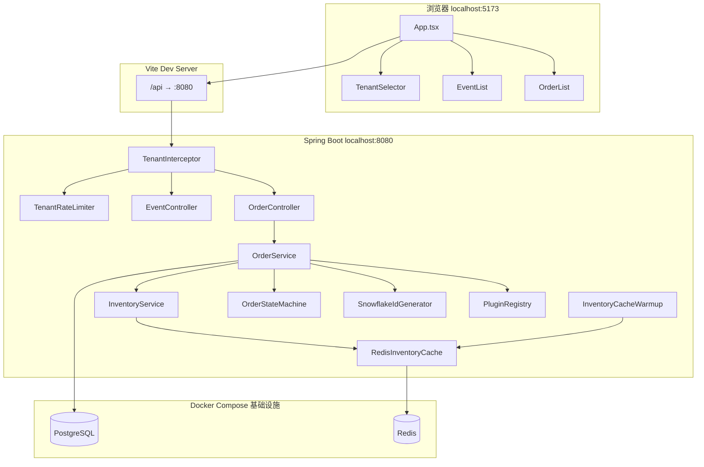

# 架构说明 — 多租户订票 SaaS Demo

本文档说明本项目的架构设计与关键决策，建议配合源码按「推荐阅读顺序」逐文件阅读。

---

## 1. 整体架构



---

## 2. 设计要点与代码映射

### 2.1 数据隔离与存储模型

| 模式 | 说明 | Demo 中的体现 |
|------|------|--------------|
| 独立数据库 | 物理隔离最强 | `Tenant.isolationMode = DEDICATED_DB`（金牌租户声明） |
| 共享库独立 Schema | 折中方案 | `SHARED_SCHEMA`（银牌租户声明） |
| 共享表 + tenant_id | 成本最低 | **Demo 实际实现**：所有 Repository 查询带 `tenantId` |

关键文件：
- `model/Tenant.java` — 隔离模式声明
- `repository/TicketEventRepository.java` — `findByTenantId...`
- `tenant/TenantContext.java` — 请求级租户上下文

### 2.2 租户身份识别与访问控制

```
HTTP Request
  └─ Header: X-Tenant-ID: tenant-silver
       └─ TenantInterceptor.preHandle()
            ├─ 校验租户存在
            ├─ TenantRateLimiter.acquire()
            └─ TenantContext.set(tenantInfo)
```

生产环境演进：JWT claim 解析 → 网关校验 → Header 透传 → MDC 日志。

关键文件：
- `tenant/TenantInterceptor.java`
- `ratelimit/TenantRateLimiter.java`

### 2.3 高并发库存扣减（两阶段）

```
1. RedisInventoryCache.tryReserve()      ← Lua 脚本原子预占
2. TicketEventRepository.deductStockCas() ← PostgreSQL 乐观锁 CAS
3. 若 2 失败 → release 回滚 Redis
4. 启动时 InventoryCacheWarmup 将 PG 库存同步至 Redis
```

关键文件：
- `inventory/InventoryService.java`
- `inventory/RedisInventoryCache.java`
- `inventory/InventoryCacheWarmup.java`
- `repository/TicketEventRepository.java` — `@Query` CAS 更新

### 2.4 订单状态机

```
PENDING_PAYMENT → PAID → TICKET_ISSUED
       ↓              ↓
   CANCELLED      REFUNDED
```

所有变迁必须通过 `OrderStateMachine.transition()`，非法变迁返回 409。

关键文件：
- `order/OrderState.java`
- `order/OrderStateMachine.java`
- `service/OrderService.java`

### 2.5 Snowflake 分布式 ID

订单主键不使用数据库自增，而由 `SnowflakeIdGenerator` 生成 64 位趋势递增 ID，支持未来分库分表。

关键文件：`id/SnowflakeIdGenerator.java`

### 2.6 扩展字段与插件化

- **扩展字段**：`TicketEvent.extensionFields`（PostgreSQL `jsonb`），避免 per-tenant 改表
- **插件**：`OrderPlugin` 接口 + `PluginRegistry` 按租户 `enabled_plugins` 加载
- **示例**：金牌租户启用 `approval-workflow`，quantity > 10 拦截

关键文件：
- `plugin/OrderPlugin.java`
- `plugin/ApprovalWorkflowPlugin.java`
- `model/TicketEvent.java`

---

## 3. 后端分层

| 层次 | 包 | 职责 |
|------|-----|------|
| 表现层 | `controller/` | HTTP 入口，不含业务逻辑 |
| 业务层 | `service/` | 下单、状态流转、编排库存与插件 |
| 数据层 | `repository/` + `model/` | JPA 持久化，强制 tenant_id 过滤 |
| 横切 | `tenant/`、`ratelimit/`、`inventory/` | 多租户、限流、库存 |
| 领域 | `order/`、`id/`、`plugin/` | 状态机、ID、定制扩展 |

---

## 4. 前端结构

| 文件 | 职责 |
|------|------|
| `App.tsx` | 状态中心：租户切换、拉数据、下单/支付/出票 |
| `api/client.ts` | 自动附加 `X-Tenant-ID` |
| `components/TenantSelector.tsx` | 切换租户，展示等级与隔离模式 |
| `components/EventList.tsx` | 活动 + 库存 + 扩展字段 |
| `components/OrderList.tsx` | 订单 + 状态机操作按钮 |

---

## 5. HTTP API

| 方法 | 路径 | X-Tenant-ID | 说明 |
|------|------|-------------|------|
| GET | `/api/health` | 否 | 健康检查 |
| GET | `/api/tenants` | 否 | 租户列表 |
| GET | `/api/events` | 是 | 当前租户活动 |
| GET | `/api/orders` | 是 | 当前租户订单 |
| POST | `/api/orders` | 是 | 创建订单 |
| POST | `/api/orders/{id}/pay` | 是 | 支付 |
| POST | `/api/orders/{id}/issue` | 是 | 出票 |
| POST | `/api/orders/{id}/cancel` | 是 | 取消（归还库存） |

---

## 6. 推荐阅读顺序

### 第一轮：跑起来

1. `README.md`
2. `backend/resources/application.yml` + `data.sql`
3. `frontend/src/App.tsx`

### 第二轮：多租户

4. `tenant/TenantInterceptor.java`
5. `tenant/TenantContext.java`
6. `ratelimit/TenantRateLimiter.java`

### 第三轮：核心业务

7. `inventory/InventoryService.java`
8. `order/OrderStateMachine.java`
9. `service/OrderService.java`
10. `plugin/ApprovalWorkflowPlugin.java`

### 第四轮：前端联调

11. `frontend/src/api/client.ts`
12. `frontend/src/components/EventList.tsx`

---

## 7. 与 my_ai_demo_proj 的差异

| 维度 | my_ai_demo_proj | ticket_demo |
|------|-----------------|-------------|
| 核心场景 | 聊天订票 | 多租户 SaaS 订票 |
| 数据模型 | 简单 Booking 状态 | 活动库存 + 订单状态机 |
| 横切关注 | CORS | 租户隔离 + 限流 + 插件 |
| 持久化 | H2 内存库 | **PostgreSQL** + **Redis** |

两者共同点：React + Vite 前端、Spring Boot 三层架构、pnpm workspace、`/api` 代理、Docker Compose。

---

## 8. 可扩展方向

1. 实现 Schema / 独立库路由（Hibernate Multi-Tenancy）
2. Redis 延迟队列异步落库
3. JWT 登录替代 Header 直传
4. API 网关统一限流（Kong / Spring Cloud Gateway）
5. 改签、退款完整状态机分支
