# 架构说明 — 多租户订票 SaaS Demo（分布式版）

本文档说明分布式微服务架构设计、**各模块职责与协同方式**，以及关键业务的**数据流**。

> Rust 技术栈替代方案见 [RUST_ARCHITECTURE.md](./RUST_ARCHITECTURE.md)。

---

## 1. 整体架构

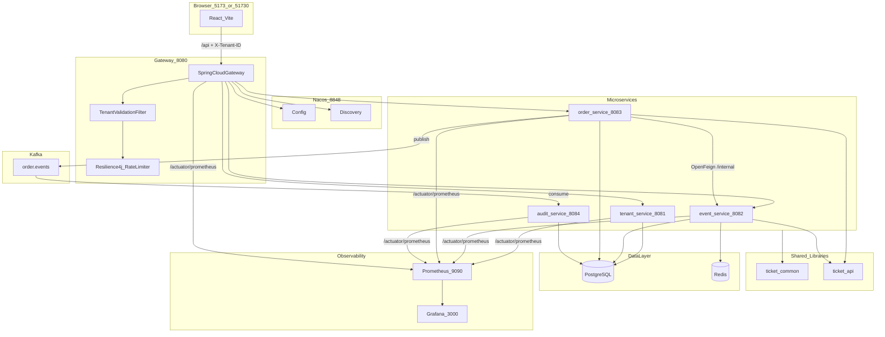

**流量分层**：

| 路径类型 | 说明 |
|----------|------|
| 浏览器 → Gateway → 微服务 | 所有 `/api/**` 业务流量，必经租户校验与限流 |
| 微服务 → 微服务 | `order-service` 经 **OpenFeign** 直连 `event-service` 的 `/internal/**`，**不经过 Gateway** |
| Prometheus → 各服务 | Docker 内网直连 `/actuator/prometheus`，不经 Gateway（避免租户 Header / 限流干扰） |

---

## 2. 技术栈

| 组件 | 选型 | 用途 |
|------|------|------|
| API 网关 | Spring Cloud Gateway | 路由、CORS、租户校验、Resilience4j 限流 |
| 注册/配置 | Nacos | 服务发现 + 动态配置 |
| 服务调用 | OpenFeign + LoadBalancer | order → event 库存/活动 |
| 限流/熔断 | Resilience4j | Gateway 租户 QPS；Feign CircuitBreaker |
| 消息 | Spring Kafka | 订单状态变更事件 |
| 持久化 | PostgreSQL + Redis | 业务数据 + 库存预占 |
| 指标 | Micrometer + Actuator | JVM / HTTP / Resilience4j → `/actuator/prometheus` |
| 采集 | Prometheus | 静态 scrape 5 个微服务（15s 间隔） |
| 可视化 | Grafana | Provisioning 数据源 + JVM Dashboard（社区模板 4701） |

版本矩阵：Spring Boot 3.3.5 + Spring Cloud 2023.0.3 + Spring Cloud Alibaba 2023.0.1.2

---

## 3. 模块职责详解

### 3.1 frontend（React + Vite）

**做什么**：多租户订票 Demo 的浏览器端，模拟 SaaS 控制台。

| 职责 | 说明 |
|------|------|
| 租户切换 | `TenantSelector` 切换当前租户，驱动 `setCurrentTenantId` |
| 活动展示 | `EventList` 展示当前租户活动、库存、扩展字段 |
| 订单操作 | `OrderList` 按状态展示「支付 / 出票 / 取消」按钮 |
| API 封装 | `client.ts` 对所有业务请求自动附加 `X-Tenant-ID` |
| 开发代理 | Vite 将 `/api` 代理到 Gateway `:8080` |

**关键文件**：`frontend/src/App.tsx`、`api/client.ts`、`components/EventList.tsx`

**数据边界**：无本地数据库；所有数据来自 Gateway 聚合的 REST API。

---

### 3.2 gateway-service（:8080）

**做什么**：对外**唯一入口**，负责路由、安全边界前的租户治理与流量控制。

| 职责 | 说明 |
|------|------|
| 路由转发 | 按路径将 `/api/tenants|events|orders/**` 转发到对应微服务 |
| 租户校验 | 调用 tenant-service 验证 `X-Tenant-ID` 合法性 |
| 元数据注入 | 校验成功后注入 `X-Tenant-Tier`、`X-Tenant-Enabled-Plugins` |
| 租户限流 | Resilience4j 按租户维度 QPS 限流，超限返回 429 |
| 健康聚合 | `GET /api/health` 探测 Nacos + 下游服务状态 |
| CORS | 允许多端口前端 Origin（5173 / 51730 等） |

**关键文件**：

- `gateway/filter/TenantValidationFilter.java` — 租户校验
- `gateway/filter/TenantRateLimitFilter.java` — 限流
- `gateway/config/GatewayRouteConfig.java` — 路由表
- `gateway/controller/GatewayHealthController.java` — 健康聚合

**数据边界**：无状态，不持久化业务数据。

**与其他模块的关系**：

- **唯一**通过 WebClient 同步调用 tenant-service（非 Feign）
- 通过 Nacos `lb://` 负载均衡到三个业务微服务
- 不调用 Kafka、不访问 PG/Redis

---

### 3.3 tenant-service（:8081）

**做什么**：租户**元数据中心**，为 Gateway 校验与下游插件/限流提供配置来源。

| 职责 | 说明 |
|------|------|
| 租户列表 | `GET /api/tenants` 供前端展示（无需 `X-Tenant-ID`） |
| 租户详情 | `GET /internal/tenants/{id}` 供 Gateway 校验 |
| 等级与配额 | 存储 `tier`（金/银/铜）、`max_qps` |
| 插件配置 | `enabled_plugins` 逗号分隔，如 `approval-workflow` |
| 隔离声明 | `isolation_mode` 声明隔离策略（Demo 未真正分库） |

**数据表 `tenants`**：

| 列 | 说明 |
|----|------|
| `tenant_id` | 主键，如 `tenant-gold` |
| `tier` | GOLD / SILVER / BRONZE |
| `max_qps` | 租户级 QPS 上限（Gateway 限流优先使用） |
| `enabled_plugins` | 启用的订单插件 ID 列表 |

**种子租户**：

| tenant_id | tier | max_qps | plugins |
|-----------|------|---------|---------|
| tenant-gold | GOLD | 100 | approval-workflow |
| tenant-silver | SILVER | 30 | — |
| tenant-bronze | BRONZE | 10 | — |

**关键文件**：`TenantController.java`、`TenantApiController.java`、`TenantService.java`

---

### 3.4 event-service（:8082）

**做什么**：票务**活动与库存**服务，是下单链路中的库存权威。

| 职责 | 说明 |
|------|------|
| 活动查询 | 按租户返回活动列表与详情（公开 API） |
| 库存扣减 | 两阶段：Redis Lua 预占 + PostgreSQL CAS |
| 库存归还 | 取消订单时归还 Redis + DB |
| 内部 API | 供 order-service Feign 调用，Header 显式传租户 |

**数据表 `ticket_events`**：

| 列 | 说明 |
|----|------|
| `tenant_id` | 逻辑隔离键 |
| `available_stock` / `total_stock` | 库存 |
| `version` | 乐观锁版本号，CAS 扣减使用 |
| `extension_fields` | jsonb 扩展（如座位图、着装要求） |

**Redis 键**：`inventory:{tenantId}:{eventId}` → 可用库存整数，TTL 7 天。

**关键文件**：

- `inventory/InventoryService.java` — 扣减编排
- `inventory/RedisInventoryCache.java` — Lua 原子预占
- `controller/EventInternalController.java` — Feign 内部端点

**双路径租户识别**：

- 公开 API（经 Gateway）：`TenantHeaderInterceptor` → `TenantContext`
- 内部 API（Feign 直连）：`@RequestHeader(X-Tenant-ID)` 显式读取（`/internal/**` 已排除拦截器）

---

### 3.5 order-service（:8083）

**做什么**：**订单生命周期**核心服务，编排跨服务库存操作、状态机与事件发布。

| 职责 | 说明 |
|------|------|
| 创建订单 | 校验活动 → 插件拦截 → 扣库存 → 写库 → 发 Kafka |
| 支付 / 出票 | 状态机驱动状态变迁，发布对应事件 |
| 取消订单 | 状态 → CANCELLED，Feign 归还库存 |
| 插件扩展 | 按租户 `enabled_plugins` 执行 `beforeCreate` / `afterCreate` |
| 分布式 ID | Snowflake 生成订单主键 |

**数据表 `orders`**：

| 列 | 说明 |
|----|------|
| `id` | Snowflake Long |
| `tenant_id` | 逻辑隔离 |
| `state` | PENDING_PAYMENT / PAID / TICKET_ISSUED / CANCELLED / REFUNDED |
| `extension_snapshot` | jsonb，插件写入的快照 |

**关键文件**：

- `service/OrderService.java` — 核心业务
- `order/OrderStateMachine.java` — 状态变迁规则
- `plugin/PluginRegistry.java`、`ApprovalWorkflowPlugin.java` — 插件体系
- `kafka/OrderEventPublisher.java` — 事件发布

**Feign 注意**：调用 event-service 时**显式传递**租户 Header（`tenantId/tier/plugins`），因 CircuitBreaker 异步线程可能丢失 `TenantContext` ThreadLocal。

---

### 3.6 audit-service（:8084）

**做什么**：**异步审计**消费者，将订单领域事件持久化，与主业务路径解耦。

| 职责 | 说明 |
|------|------|
| 消费 Kafka | 订阅 `order.events`，group=`audit-service-group` |
| 审计落库 | 将事件快照写入 `order_audit_log` |
| 健康检查 | 仅暴露 `/api/health` |

**数据表 `order_audit_log`**：

| 列 | 说明 |
|----|------|
| `event_type` | ORDER_CREATED / ORDER_PAID / ORDER_ISSUED / ORDER_CANCELLED |
| `order_id`, `tenant_id`, `event_id` | 事件快照 |
| `occurred_at` / `received_at` | 业务时间 vs 消费时间 |

**关键文件**：`consumer/OrderEventConsumer.java`

**特点**：无对外业务 API；失败重试由 Kafka 消费组机制承担（Demo 未实现 DLQ）。

---

### 3.7 ticket-common（共享库）

**做什么**：各微服务共享的**横切能力**，避免重复实现租户、ID、指标等基础设施。

| 组件 | 作用 |
|------|------|
| `TenantContext` | ThreadLocal 保存当前请求的租户信息 |
| `TenantHeaderInterceptor` | 从 Gateway 透传 Header 写入 `TenantContext` |
| `TenantConstants` | `X-Tenant-ID` / `X-Tenant-Tier` / `X-Tenant-Enabled-Plugins` / Kafka Topic |
| `SnowflakeIdGenerator` | 分布式 ID（order-service 使用） |
| `OrderState` | 订单状态枚举 |
| `ServiceWebConfig` | CORS + 拦截器注册（排除 `/internal/**`、`/actuator/**`） |
| `application-metrics.yml` | Micrometer / Prometheus 共享配置 |

**自动装配**：通过 `META-INF/spring/...AutoConfiguration.imports` 被各 Servlet 微服务引入。

---

### 3.8 ticket-api（共享库）

**做什么**：**服务间契约层**——DTO、Feign 接口、Kafka 事件模型。

| 类型 | 内容 |
|------|------|
| Feign 客户端 | `EventQueryClient`、`EventInventoryClient`、`TenantClient` |
| DTO | `CreateOrderRequest`、`OrderResponse`、`EventResponse`、`InventoryDeductRequest` 等 |
| 事件 | `OrderEvent`、`OrderEventType` |
| 拦截器 | `TenantFeignInterceptor` — 自动附加租户 Header |

**设计意图**：order-service 依赖 ticket-api 调用 event-service，API 契约与实现分离，类似「客户端 SDK」。

---

## 4. 模块协同机制

### 4.1 租户上下文如何贯穿全链路

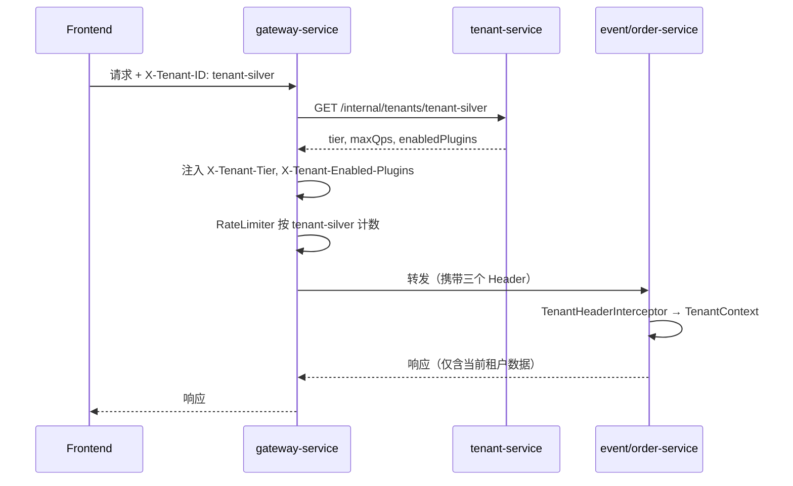

**要点**：

1. 前端只传 `X-Tenant-ID`；等级与插件由 Gateway **权威注入**，防止客户端伪造。
2. 各微服务 Repository 查询均带 `tenantId`，实现**共享表逻辑隔离**。
3. `/api/tenants`、`/api/health` 可不带租户 Header；其余业务 API 必须带。

### 4.2 同步调用 vs 异步事件

| 协作方式 | 场景 | 技术 |
|----------|------|------|
| 同步 HTTP | Gateway → 微服务；order → event 扣库存 | WebClient / OpenFeign |
| 异步消息 | 订单状态变更 → 审计落库 | Kafka `order.events` |
| 服务发现 | Gateway / Feign 解析服务地址 | Nacos + `lb://` |

**设计取舍**：库存扣减必须同步成功才创建订单（强一致倾向）；审计日志允许异步最终一致。

### 4.3 服务依赖关系

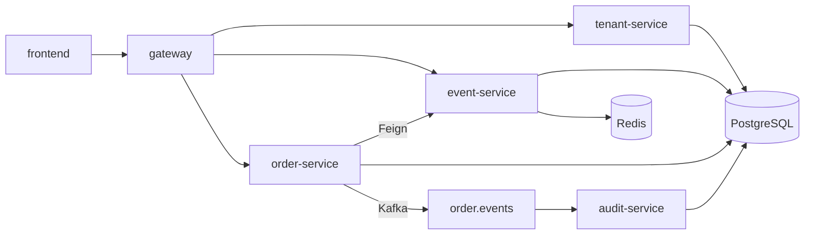

- **audit-service** 不反向调用任何业务服务。
- **event-service** 不感知订单状态，仅响应扣减/归还请求。
- **tenant-service** 仅在 Gateway 校验链中被读取，不参与下单事务。

---

## 5. 业务数据流（Mermaid）

### 5.1 用户浏览活动（读路径）

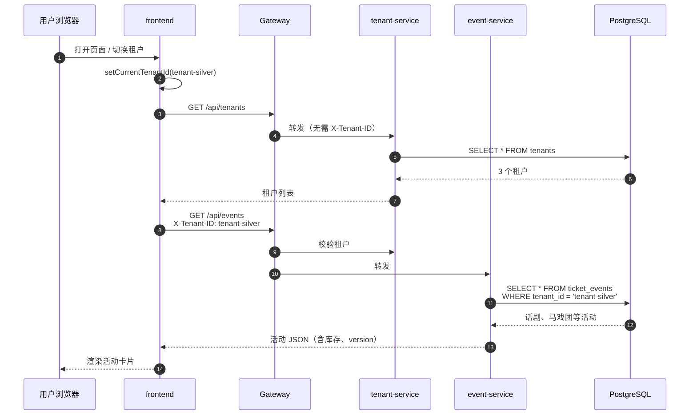

### 5.2 创建订单（写路径 + 跨服务）

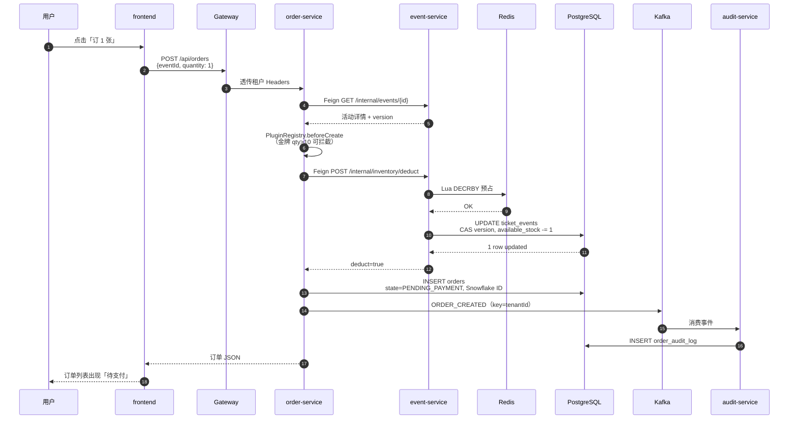

**库存与订单写入顺序**：先扣库存，再写订单。扣库存失败直接 409，不产生脏订单。

### 5.3 支付与出票

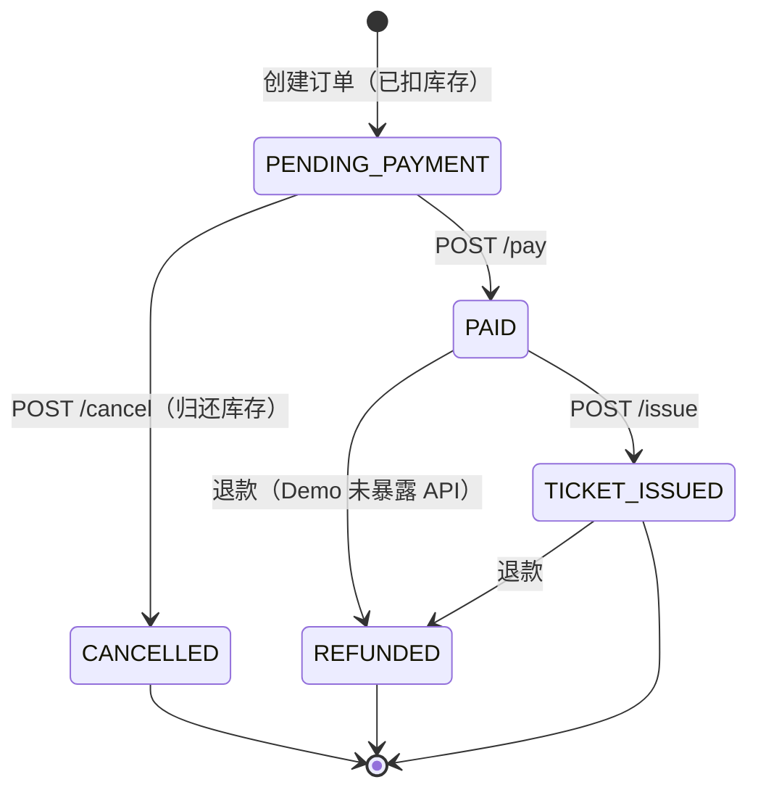

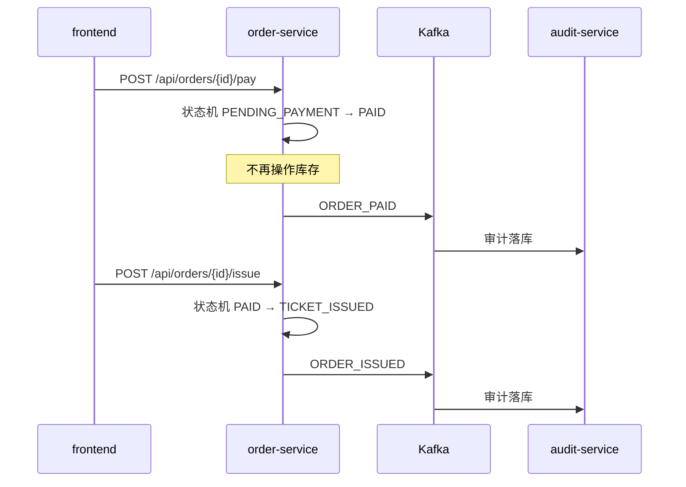

### 5.4 取消订单（库存归还）

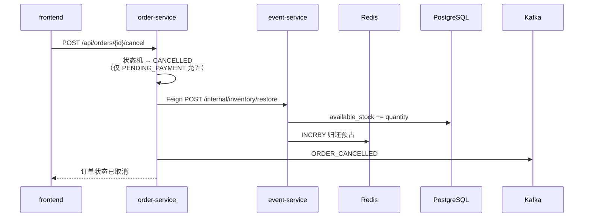

### 5.5 库存两阶段扣减（event-service 内部）

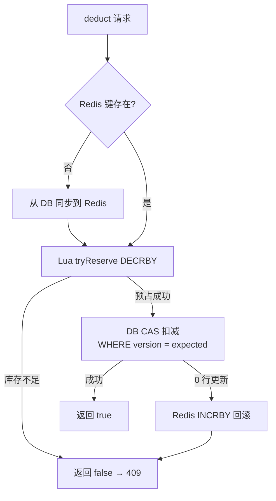

### 5.6 审批流插件（金牌租户定制）

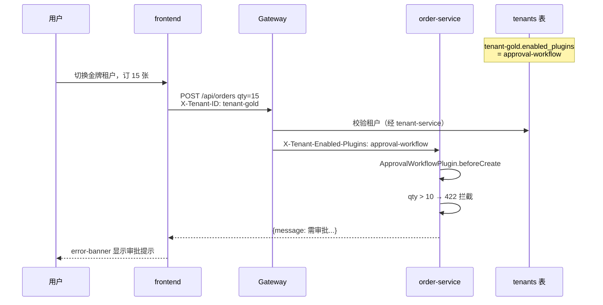

### 5.7 Gateway 限流（防噪声邻居）

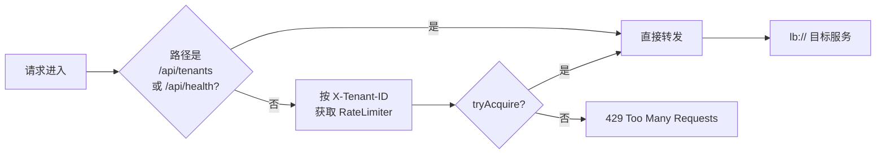

配额优先级：`tenants.max_qps`（DB）> 按 tier 默认值（金 100 / 银 30 / 铜 10）。

### 5.8 Kafka 订单事件流

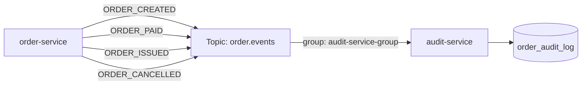

| 字段 | 值 |
|------|-----|
| Topic | `order.events` |
| Key | `tenantId`（保证同租户分区有序） |
| Value | `OrderEvent` JSON |

---

## 6. HTTP API（经 Gateway）

| 方法 | 路径 | X-Tenant-ID | 路由目标 |
|------|------|-------------|----------|
| GET | `/api/health` | 否 | Gateway 聚合 |
| GET | `/api/tenants` | 否 | tenant-service |
| GET | `/api/events` | 是 | event-service |
| GET | `/api/orders` | 是 | order-service |
| POST | `/api/orders` | 是 | order-service |
| POST | `/api/orders/{id}/pay` | 是 | order-service |
| POST | `/api/orders/{id}/issue` | 是 | order-service |
| POST | `/api/orders/{id}/cancel` | 是 | order-service |

**内部 API（不经过 Gateway，仅供 Feign）**：

| 方法 | 路径 | 调用方 |
|------|------|--------|
| GET | `/internal/tenants/{id}` | Gateway WebClient |
| GET | `/internal/events/{id}` | order-service Feign |
| POST | `/internal/inventory/deduct` | order-service Feign |
| POST | `/internal/inventory/restore` | order-service Feign |

指标端点（Docker 内网直连）：各服务 `/actuator/prometheus`

---

## 7. 设计要点与代码映射

### 7.1 数据隔离

Demo 使用**共享 PostgreSQL**，各服务管理自己的表；Repository 查询带 `tenantId`。`isolation_mode` 字段声明了 SCHEMA / 独立库等模式，但 Demo 未真正分库。

### 7.2 限流（Gateway Resilience4j）

替换原单体 `TenantRateLimiter`：按 `X-Tenant-ID` 维度限流。

关键文件：`gateway/filter/TenantRateLimitFilter.java`、`gateway/config/Resilience4jMetricsConfig.java`

### 7.3 库存两阶段扣减

`RedisInventoryCache`（Lua 预占）+ `TicketEventRepository.deductStockCas`（DB CAS）。

order-service 通过 `EventInventoryClient` 远程调用。

### 7.4 订单事件

Topic：`order.events`，key=`tenantId`。事件类型：`ORDER_CREATED|PAID|ISSUED|CANCELLED`。

---

## 8. 可观测性

### 8.1 指标导出

各微服务引入 `micrometer-registry-prometheus`，通过 `ticket-common` 的 `application-metrics.yml` 统一配置：

- 暴露端点：`health`, `info`, `prometheus`
- 全局标签：`application=${spring.application.name}`
- HTTP 直方图：`http.server.requests` 启用 percentiles-histogram

Gateway 额外暴露 `gateway` 端点，并启用 `spring.cloud.gateway` 指标。

### 8.2 Resilience4j 指标

| 服务 | 绑定 | 典型指标 |
|------|------|----------|
| gateway-service | `TaggedRateLimiterMetrics` → 共享 `RateLimiterRegistry` | `resilience4j_ratelimiter_*` |
| order-service | `TaggedCircuitBreakerMetrics` + `TaggedRetryMetrics` | `resilience4j_circuitbreaker_*`, `resilience4j_retry_*` |

### 8.3 Prometheus 采集

配置文件：`docker/prometheus/prometheus.yml`

- Job：`ticket-demo`
- Path：`/actuator/prometheus`
- Targets：5 个微服务 Docker 服务名 + 端口（静态配置，Demo 不用 Nacos SD）
- 标签：`env=demo`

验证：http://localhost:9090/targets（期望 5 个 UP）

### 8.4 Grafana 可视化

| 路径 | 说明 |
|------|------|
| `docker/grafana/provisioning/datasources/` | 自动配置 Prometheus 数据源（uid=`prometheus`） |
| `docker/grafana/provisioning/dashboards/` | 自动加载 `Ticket Demo` 文件夹 |
| `docker/grafana/dashboards/spring-boot.json` | JVM (Micrometer) Dashboard（基于 grafana.com 4701） |

访问：http://localhost:3000（`admin` / `admin`）。

### 8.5 Metrics vs Tracing

| 维度 | 工具 | 用途 |
|------|------|------|
| Metrics（已实现） | Micrometer + Prometheus + Grafana | 趋势、容量、限流/熔断告警 |
| Tracing（未实现） | Micrometer Tracing + Zipkin | 单次请求跨服务调用链 |

---

## 9. 推荐阅读顺序

1. `docker-compose.yml` — 基础设施与服务依赖
2. `frontend/src/App.tsx` — 前端如何驱动租户与订单操作
3. `gateway-service/.../TenantValidationFilter.java` — 租户校验链
4. `gateway-service/.../TenantRateLimitFilter.java` — 限流
5. `ticket-api/.../EventInventoryClient.java` — 跨服务契约
6. `order-service/.../OrderService.java` — 订单全生命周期
7. `order-service/.../plugin/ApprovalWorkflowPlugin.java` — 插件示例
8. `event-service/.../InventoryService.java` — 库存两阶段扣减
9. `audit-service/.../OrderEventConsumer.java` — 异步审计

---

## 10. 生产演进建议

1. 各服务独立数据库（当前 Demo 共享 PG 降低复杂度）
2. 下单失败补偿（Outbox / Saga 归还库存）
3. JWT 替代 Header 直传
4. Micrometer Tracing + Zipkin 全链路追踪（与现有 Prometheus 指标互补）
5. 生产可观测性加固：限制 `/actuator` 外网暴露、Alertmanager 告警规则
6. K8s Helm 部署（基于 `Dockerfile.service` 镜像）

---

## 11. 相关文档

- [RUST_ARCHITECTURE.md](./RUST_ARCHITECTURE.md) — Rust 全栈替代方案
- [../README.md](../README.md) — 启动与 E2E 说明
