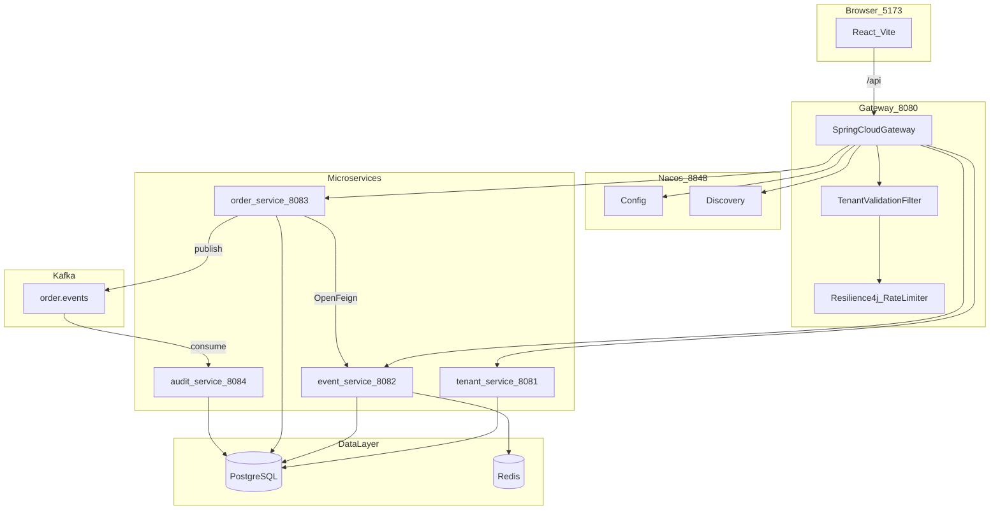

# 架构说明 — 多租户订票 SaaS Demo（分布式版）

本文档说明分布式微服务架构设计与关键决策。

---

## 1. 整体架构



---

## 2. 技术栈

| 组件 | 选型 | 用途 |
|------|------|------|
| API 网关 | Spring Cloud Gateway | 路由、CORS、租户校验、Resilience4j 限流 |
| 注册/配置 | Nacos | 服务发现 + 动态配置 |
| 服务调用 | OpenFeign + LoadBalancer | order → event 库存/活动 |
| 限流/熔断 | Resilience4j | Gateway 租户 QPS；Feign CircuitBreaker |
| 消息 | Spring Kafka | 订单状态变更事件 |
| 持久化 | PostgreSQL + Redis | 业务数据 + 库存预占 |

版本矩阵：Spring Boot 3.3.5 + Spring Cloud 2023.0.3 + Spring Cloud Alibaba 2023.0.1.2

---

## 3. 服务边界

| 服务 | 端口 | 职责 | 关键包 |
|------|------|------|--------|
| gateway-service | 8080 | 对外唯一入口、租户校验、限流、健康聚合 | `gateway/filter/` |
| tenant-service | 8081 | 租户元数据、`/internal/tenants/{id}` | `model/Tenant`, `service/TenantService` |
| event-service | 8082 | 活动 CRUD、Redis+PG 库存、内部库存 API | `inventory/`, `controller/EventInternalController` |
| order-service | 8083 | 订单状态机、插件、Feign 扣库存、Kafka 发布 | `service/OrderService`, `kafka/` |
| audit-service | 8084 | 消费 `order.events` 写入 `order_audit_log` | `consumer/OrderEventConsumer` |

共享模块：
- `ticket-common` — `TenantContext`、枚举、`SnowflakeIdGenerator`
- `ticket-api` — Feign 接口、DTO、`OrderEvent`

---

## 4. 请求链路

### 4.1 带租户的 API

```
Client → Gateway
  ├─ TenantValidationFilter → tenant-service /internal/tenants/{id}
  ├─ TenantRateLimitFilter（Resilience4j，按租户 maxQps）
  └─ 路由 lb://{service}，透传 X-Tenant-ID / X-Tenant-Tier / X-Tenant-Enabled-Plugins
       └─ 微服务 TenantHeaderInterceptor → TenantContext
```

### 4.2 下单（跨服务 + 事件）

```
POST /api/orders
  → order-service
    → Feign EventQueryClient.getEvent
    → 插件 beforeCreate
    → Feign EventInventoryClient.deduct
    → 写 orders 表
    → Kafka ORDER_CREATED
  → audit-service 异步落库
```

---

## 5. 设计要点与代码映射

### 5.1 数据隔离

Demo 使用共享 PostgreSQL，各服务管理自己的表；Repository 查询带 `tenantId`。

### 5.2 限流（Gateway Resilience4j）

替换原单体 `TenantRateLimiter`：按 `X-Tenant-ID` 维度限流，配额来自 tenant-service 的 `maxQps` 或 Nacos `tenant.rate-limit.*`。

关键文件：`gateway/filter/TenantRateLimitFilter.java`

### 5.3 库存两阶段扣减

仍在 event-service：`RedisInventoryCache` + `deductStockCas`。

order-service 通过 `EventInventoryClient` 远程调用。

### 5.4 订单事件

Topic：`order.events`，key=`tenantId`。事件类型：`ORDER_CREATED|PAID|ISSUED|CANCELLED`。

---

## 6. HTTP API（经 Gateway）

| 方法 | 路径 | X-Tenant-ID | 路由目标 |
|------|------|-------------|----------|
| GET | `/api/health` | 否 | Gateway 聚合 |
| GET | `/api/tenants` | 否 | tenant-service |
| GET | `/api/events` | 是 | event-service |
| GET | `/api/orders` | 是 | order-service |
| POST | `/api/orders` | 是 | order-service |
| POST | `/api/orders/{id}/pay` | 是 | order-service |
| POST | `/api/orders/{id}/issue` | 是 | order-service |
| POST | `/api/orders/{id}/cancel` | 是 | order-service |

内部 API（不经过 Gateway）：`/internal/**`

---

## 7. 推荐阅读顺序

1. `docker-compose.yml` — 基础设施与服务依赖
2. `gateway-service/.../TenantValidationFilter.java`
3. `gateway-service/.../TenantRateLimitFilter.java`
4. `ticket-api/.../EventInventoryClient.java`
5. `order-service/.../OrderService.java`
6. `event-service/.../InventoryService.java`
7. `audit-service/.../OrderEventConsumer.java`

---

## 8. 生产演进建议

1. 各服务独立数据库（当前 Demo 共享 PG 降低复杂度）
2. 下单失败补偿（Outbox / Saga 归还库存）
3. JWT 替代 Header 直传
4. Micrometer Tracing + Zipkin 全链路追踪
5. K8s Helm 部署（基于 `Dockerfile.service` 镜像）
