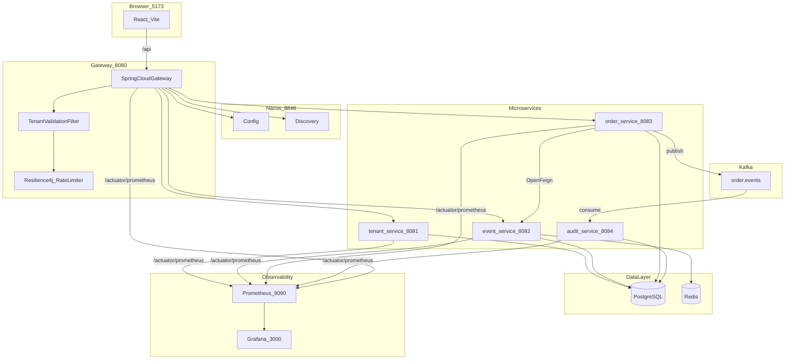

# 架构说明 — 多租户订票 SaaS Demo（分布式版）

本文档说明分布式微服务架构设计与关键决策。

---

## 1. 整体架构



业务流量仅经 Gateway；Prometheus 在 Docker 内网**直连各服务端口**拉取指标，不经过 Gateway（避免租户 Header / 限流干扰）。

---

## 2. 技术栈

| 组件 | 选型 | 用途 |
|------|------|------|
| API 网关 | Spring Cloud Gateway | 路由、CORS、租户校验、Resilience4j 限流 |
| 注册/配置 | Nacos | 服务发现 + 动态配置 |
| 服务调用 | OpenFeign + LoadBalancer | order → event 库存/活动 |
| 限流/熔断 | Resilience4j | Gateway 租户 QPS；Feign CircuitBreaker |
| 消息 | Spring Kafka | 订单状态变更事件 |
| 持久化 | PostgreSQL + Redis | 业务数据 + 库存预占 |
| 指标 | Micrometer + Actuator | JVM / HTTP / Resilience4j → `/actuator/prometheus` |
| 采集 | Prometheus | 静态 scrape 5 个微服务（15s 间隔） |
| 可视化 | Grafana | Provisioning 数据源 + JVM Dashboard（社区模板 4701） |

版本矩阵：Spring Boot 3.3.5 + Spring Cloud 2023.0.3 + Spring Cloud Alibaba 2023.0.1.2

---

## 3. 服务边界

| 服务 | 端口 | 职责 | 指标端点 | 关键包 |
|------|------|------|----------|--------|
| gateway-service | 8080 | 对外唯一入口、租户校验、限流、健康聚合 | `/actuator/prometheus` + `gateway` | `gateway/filter/` |
| tenant-service | 8081 | 租户元数据、`/internal/tenants/{id}` | `/actuator/prometheus` | `model/Tenant`, `service/TenantService` |
| event-service | 8082 | 活动 CRUD、Redis+PG 库存、内部库存 API | `/actuator/prometheus` | `inventory/`, `controller/EventInternalController` |
| order-service | 8083 | 订单状态机、插件、Feign 扣库存、Kafka 发布 | `/actuator/prometheus` + CircuitBreaker/Retry 指标 | `service/OrderService`, `kafka/` |
| audit-service | 8084 | 消费 `order.events` 写入 `order_audit_log` | `/actuator/prometheus` | `consumer/OrderEventConsumer` |

共享模块：
- `ticket-common` — `TenantContext`、枚举、`SnowflakeIdGenerator`、共享 `application-metrics.yml`
- `ticket-api` — Feign 接口、DTO、`OrderEvent`

---

## 4. 请求链路

### 4.1 带租户的 API

```
Client → Gateway
  ├─ TenantValidationFilter → tenant-service /internal/tenants/{id}
  ├─ TenantRateLimitFilter（Resilience4j，按租户 maxQps）
  └─ 路由 lb://{service}，透传 X-Tenant-ID / X-Tenant-Tier / X-Tenant-Enabled-Plugins
       └─ 微服务 TenantHeaderInterceptor → TenantContext
```

`/actuator/**` 已在 `ServiceWebConfig` 中排除租户拦截，Prometheus scrape 无需 `X-Tenant-ID`。

### 4.2 下单（跨服务 + 事件）

```
POST /api/orders
  → order-service
    → Feign EventQueryClient.getEvent
    → 插件 beforeCreate
    → Feign EventInventoryClient.deduct
    → 写 orders 表
    → Kafka ORDER_CREATED
  → audit-service 异步落库
```

---

## 5. 设计要点与代码映射

### 5.1 数据隔离

Demo 使用共享 PostgreSQL，各服务管理自己的表；Repository 查询带 `tenantId`。

### 5.2 限流（Gateway Resilience4j）

替换原单体 `TenantRateLimiter`：按 `X-Tenant-ID` 维度限流，配额来自 tenant-service 的 `maxQps` 或 Nacos `tenant.rate-limit.*`。

共享 `RateLimiterRegistry` 注册 Micrometer 指标（`resilience4j_ratelimiter_*`），便于在 Grafana 观察租户限流。

关键文件：
- `gateway/filter/TenantRateLimitFilter.java`
- `gateway/config/Resilience4jMetricsConfig.java`

### 5.3 库存两阶段扣减

仍在 event-service：`RedisInventoryCache` + `deductStockCas`。

order-service 通过 `EventInventoryClient` 远程调用。

### 5.4 订单事件

Topic：`order.events`，key=`tenantId`。事件类型：`ORDER_CREATED|PAID|ISSUED|CANCELLED`。

---

## 6. 可观测性

### 6.1 指标导出

各微服务引入 `micrometer-registry-prometheus`，通过 `ticket-common` 的 `application-metrics.yml` 统一配置：

- 暴露端点：`health`, `info`, `prometheus`
- 全局标签：`application=${spring.application.name}`
- HTTP 直方图：`http.server.requests` 启用 percentiles-histogram

Gateway 额外暴露 `gateway` 端点，并启用 `spring.cloud.gateway` 指标。

### 6.2 Resilience4j 指标

| 服务 | 绑定 | 典型指标 |
|------|------|----------|
| gateway-service | `TaggedRateLimiterMetrics` → 共享 `RateLimiterRegistry` | `resilience4j_ratelimiter_*` |
| order-service | `TaggedCircuitBreakerMetrics` + `TaggedRetryMetrics` | `resilience4j_circuitbreaker_*`, `resilience4j_retry_*` |

### 6.3 Prometheus 采集

配置文件：`docker/prometheus/prometheus.yml`

- Job：`ticket-demo`
- Path：`/actuator/prometheus`
- Targets：5 个微服务 Docker 服务名 + 端口（静态配置，Demo 不用 Nacos SD）
- 标签：`env=demo`

验证：http://localhost:9090/targets（期望 5 个 UP；Gateway 容器未启动时为 DOWN）

### 6.4 Grafana 可视化

| 路径 | 说明 |
|------|------|
| `docker/grafana/provisioning/datasources/` | 自动配置 Prometheus 数据源（uid=`prometheus`） |
| `docker/grafana/provisioning/dashboards/` | 自动加载 `Ticket Demo` 文件夹 |
| `docker/grafana/dashboards/spring-boot.json` | JVM (Micrometer) Dashboard（基于 grafana.com 4701） |

访问：http://localhost:3000（`admin` / `admin`）。Dashboard 变量 **Application** 选择具体服务（如 `order-service`）查看 JVM / CPU 曲线。

Docker 注意：`prometheus` / `grafana` 服务设置 `NO_PROXY=*`，避免宿主机 HTTP 代理导致 Grafana 无法访问 Prometheus。

### 6.5 Metrics vs Tracing

| 维度 | 工具 | 用途 |
|------|------|------|
| Metrics（已实现） | Micrometer + Prometheus + Grafana | 趋势、容量、限流/熔断告警 |
| Tracing（未实现） | Micrometer Tracing + Zipkin | 单次请求跨服务调用链 |

---

## 7. HTTP API（经 Gateway）

| 方法 | 路径 | X-Tenant-ID | 路由目标 |
|------|------|-------------|----------|
| GET | `/api/health` | 否 | Gateway 聚合 |
| GET | `/api/tenants` | 否 | tenant-service |
| GET | `/api/events` | 是 | event-service |
| GET | `/api/orders` | 是 | order-service |
| POST | `/api/orders` | 是 | order-service |
| POST | `/api/orders/{id}/pay` | 是 | order-service |
| POST | `/api/orders/{id}/issue` | 是 | order-service |
| POST | `/api/orders/{id}/cancel` | 是 | order-service |

内部 API（不经过 Gateway）：`/internal/**`

指标端点（不经过 Gateway 路由，Docker 内网直连）：各服务 `/actuator/prometheus`

---

## 8. 推荐阅读顺序

1. `docker-compose.yml` — 基础设施与服务依赖（含 prometheus / grafana）
2. `ticket-common/.../application-metrics.yml` — 共享指标配置
3. `docker/prometheus/prometheus.yml` — scrape 目标
4. `gateway-service/.../TenantValidationFilter.java`
5. `gateway-service/.../TenantRateLimitFilter.java`
6. `gateway-service/.../Resilience4jMetricsConfig.java`
7. `ticket-api/.../EventInventoryClient.java`
8. `order-service/.../OrderService.java`
9. `order-service/.../Resilience4jMetricsConfig.java`
10. `event-service/.../InventoryService.java`
11. `audit-service/.../OrderEventConsumer.java`

---

## 9. 生产演进建议

1. 各服务独立数据库（当前 Demo 共享 PG 降低复杂度）
2. 下单失败补偿（Outbox / Saga 归还库存）
3. JWT 替代 Header 直传
4. Micrometer Tracing + Zipkin 全链路追踪（与现有 Prometheus 指标互补）
5. 生产可观测性加固：限制 `/actuator` 外网暴露、独立 management 端口、Alertmanager 告警规则
6. K8s Helm 部署（基于 `Dockerfile.service` 镜像；可改用 Prometheus Operator + ServiceMonitor 替代静态 scrape）
