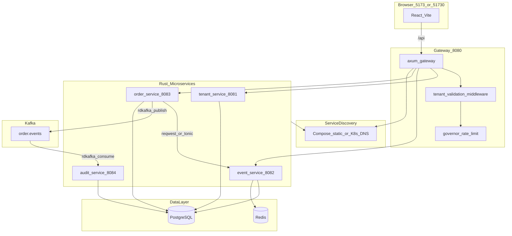

# Rust 全栈替代方案 — 多租户订票 SaaS Demo

本文档描述如何用 **Rust** 完整替代当前 Java 微服务架构（Spring Cloud Gateway + Nacos + Kafka + OpenFeign + Resilience4j），并给出各模块的推荐技术选型与工程结构。

> 对照现有实现请参阅 [ARCHITECTURE.md](./ARCHITECTURE.md)。

---

## 1. 结论摘要

**可以有完整替代方案。** 前端（React + Vite）、中间件（PostgreSQL、Redis、Kafka）和 API 契约（`/api/*`、`X-Tenant-ID`）均可保持不变，仅替换后端实现语言与服务治理组合方式。

| 维度 | Java 现状 | Rust 替代思路 |
|------|-----------|---------------|
| 微服务框架 | Spring Boot 3 | **axum** + **tokio**（每服务一个 binary） |
| API 网关 | Spring Cloud Gateway | **axum/tower** 自研网关，或 **pingora** / Envoy |
| 注册/配置 | Nacos | Docker Compose 静态发现（开发）/ **K8s** 或 **Consul**（生产） |
| 服务间调用 | OpenFeign | **reqwest**（REST）或 **tonic**（gRPC） |
| 限流/熔断 | Resilience4j | **tower** + **governor** + **backon** |
| 消息 | Spring Kafka | **rdkafka** |
| 持久化 | JPA / JDBC | **sqlx** 或 **sea-orm** |
| 缓存 | Spring Data Redis | **redis** / **fred** |
| 共享库 | ticket-common / ticket-api | Cargo workspace 下的 `crates/*` |

---

## 2. 整体架构（Rust 版）



---

## 3. 推荐工程结构（Cargo Workspace）

```
ticket_demo_rs/
├── Cargo.toml                 # workspace 根
├── crates/
│   ├── common/                # 对应 ticket-common
│   ├── api-types/             # 对应 ticket-api（DTO、事件定义）
│   ├── clients/               # 对应 Feign 客户端
│   └── plugins/               # 订单插件 trait + 内置实现
├── gateway-service/             # :8080
├── tenant-service/              # :8081
├── event-service/               # :8082
├── order-service/               # :8083
├── audit-service/               # :8084
├── docker-compose.yml
├── proto/                       # 可选：gRPC .proto 定义
└── frontend/                    # 可复用现有 React 项目
```

**运行时**：统一 **Tokio** 异步运行时；每个服务独立 binary，镜像构建方式与现有 `Dockerfile.service` 类似（多阶段 `cargo build --release`）。

---

## 4. 模块对照表

| 现有 Java 模块 | Rust crate / 服务 | 推荐技术 |
|----------------|-------------------|----------|
| `ticket-common` | `crates/common` | 租户上下文、枚举、Snowflake、统一错误类型、tracing 初始化 |
| `ticket-api` | `crates/api-types` + `crates/clients` | **serde** DTO；HTTP/gRPC 客户端 |
| `gateway-service` | `gateway-service` | **axum** + **tower** 中间件 |
| `tenant-service` | `tenant-service` | **axum** + **sqlx** |
| `event-service` | `event-service` | **axum** + **sqlx** + **redis/fred** |
| `order-service` | `order-service` | **axum** + 状态机 + 插件 + **rdkafka** producer |
| `audit-service` | `audit-service` | **rdkafka** consumer + **sqlx** |
| Spring Cloud Gateway | 见 §5.1 | axum 反代 或 pingora/Envoy |
| Nacos | 见 §5.2 | Compose 静态名 / K8s / Consul |
| OpenFeign | 见 §5.3 | reqwest 或 tonic |
| Resilience4j | 见 §5.4 | tower + governor + backon |
| Spring Kafka | **rdkafka** | 生产环境首选绑定 |
| JPA / JDBC | **sqlx** / **sea-orm** | 见 §5.5 |
| Actuator / Prometheus | **tracing** + **metrics** | 见 §5.7 |

---

## 5. 各层技术选型详解

### 5.1 API 网关（gateway-service :8080）

**职责（与 Java 版一致）**：唯一对外入口、CORS、租户校验、按租户 QPS 限流、路由转发、健康聚合。

#### 方案 A：自研 axum 网关（最贴近现状）

| 能力 | Rust 选型 |
|------|-----------|
| HTTP 服务 | **axum** |
| CORS | **tower-http** `CorsLayer` |
| 租户校验 | 自定义 middleware → `reqwest` 调 `tenant-service /internal/tenants/{id}` |
| 限流 | **governor** 或 **tower-governor**（按 `X-Tenant-ID` 维度） |
| 反向代理 | **hyper** / **reqwest** 转发，或 **pingora** 作为代理核心 |
| Header 透传 | `X-Tenant-ID`、`X-Tenant-Tier`、`X-Tenant-Enabled-Plugins` |

中间件链建议顺序：

```
Request → CORS → TenantValidation → TenantRateLimit → RouteProxy → Upstream
```

#### 方案 B：边缘代理 + 轻量鉴权服务（偏运维/K8s）

- 网关：**Envoy Gateway** / **Traefik** / **pingora** 独立部署
- 租户逻辑：独立 **auth-gateway**（axum）或 Envoy **ext_authz**
- 适合生产与 K8s，但不像 Spring Cloud Gateway 那样「单进程全包」

---

### 5.2 服务发现与配置（替代 Nacos）

Nacos 在 Rust 生态并非一等公民；迁移时通常调整治理模型，而非逐行平替。

| 能力 | Java（Nacos） | Rust 常见替代 |
|------|---------------|---------------|
| 服务发现 | Nacos Discovery | **Docker Compose 服务名**（开发）、**Kubernetes Service DNS**（生产）、**Consul** |
| 动态配置 | Nacos Config | **figment** + 环境变量、**Consul KV**、**etcd**、K8s ConfigMap/Secret |
| 客户端负载均衡 | Spring Cloud LoadBalancer | K8s Service / **tower::balance** / 简单 round-robin |

**务实建议**：

- **本地 / Demo**：`http://tenant-service:8081` 等固定 URL，与当前 `docker-compose.yml` 一致，无需注册中心。
- **生产**：优先 **K8s 原生发现**，比维护 Nacos Rust 客户端更省事。
- **若必须保留 Nacos**：可通过 HTTP API 自研轻量 client，维护成本较高，不作为首选。

---

### 5.3 服务间调用（替代 OpenFeign）

| 方式 | 说明 | 适用场景 |
|------|------|----------|
| **reqwest + serde** | REST JSON，最接近 OpenFeign | 平替迁移、前后端契约不变 |
| **tonic + prost** | gRPC，强类型、性能好 | 生产、服务间内部 API |
| **grpc-gateway** | 对外 REST、对内 gRPC | 需要同时兼容浏览器与微服务 |

当前 Java 版调用链（order → event）在 Rust 中对应：

```
crates/clients/
├── event_query_client.rs      # EventQueryClient
├── event_inventory_client.rs  # deduct / restore
└── tenant_client.rs           # 网关校验租户（可选复用）
```

熔断、重试、超时：

- **backon** 或 **failsafe-rs**
- **tower::retry**、**tower::timeout**

---

### 5.4 限流与熔断（替代 Resilience4j）

| Java | Rust |
|------|------|
| Gateway `TenantRateLimitFilter` | **governor** 按租户维度令牌桶 |
| Feign CircuitBreaker | **tower** 组合 + 自定义 `ServiceBuilder` |
| 重试 | **backon** 指数退避 |

配额来源与 Java 版相同：tenant-service 返回的 `maxQps`，或配置文件中的 `tenant.rate-limit.gold/silver/bronze`。

---

### 5.5 数据访问（PostgreSQL + Redis）

| 组件 | 推荐 crate | 说明 |
|------|------------|------|
| PostgreSQL | **sqlx** | 异步、可编译期校验 SQL；适合 Demo 到生产 |
| PostgreSQL（ORM） | **sea-orm** | 更接近 JPA 体验 |
| Redis | **fred**（高性能）或 **redis** | 库存 Lua 脚本与 Java 版相同 |

**event-service 库存**：继续使用 **Redis Lua 预占 + PostgreSQL CAS**（`version` 字段），逻辑可直接移植。

---

### 5.6 消息（Kafka）

| 用途 | Rust 选型 |
|------|-----------|
| order-service 发布 | **rdkafka** `FutureProducer` |
| audit-service 消费 | **rdkafka** `StreamConsumer` |
| Topic | `order.events`（与现网一致） |
| 消息体 | JSON（平替）或 **protobuf**（路线 2） |

幂等：audit 表对 `order_id + event_type` 建唯一约束，与 Java 版一致。

---

### 5.7 可观测性（替代 Actuator + Micrometer）

| 能力 | Rust 选型 |
|------|-----------|
| 结构化日志 | **tracing** + **tracing-subscriber** |
| 指标 | **metrics** + **metrics-exporter-prometheus** |
| HTTP 指标 | **axum-prometheus** 或 tower 中间件 |
| 链路追踪 | **tracing-opentelemetry** + Jaeger/Tempo |

现有 Prometheus/Grafana 栈可继续 scrape 各服务 `/metrics` 端点。

---

## 6. 各微服务职责与实现要点

### 6.1 tenant-service（:8081）

- **框架**：axum + sqlx
- **API**：`GET /api/tenants`、`GET /internal/tenants/{id}`
- **数据**：租户 tier、maxQps、enabled_plugins（逗号分隔）

### 6.2 event-service（:8082）

- **框架**：axum + sqlx + redis
- **API**：`GET /api/events`；内部 `GET /internal/events/{id}`、`POST /internal/inventory/deduct|restore`
- **租户**：从 Header 读 `X-Tenant-ID`（网关透传），写入 request extension，**勿用 ThreadLocal**

### 6.3 order-service（:8083）

- **框架**：axum + sqlx + rdkafka + clients
- **核心逻辑**：
  - `OrderStateMachine`：Rust `enum` + 显式状态转换
  - `PluginRegistry`：`trait OrderPlugin` + 编译期注册列表
  - 审批流插件：quantity > 10 返回 422（与 `ApprovalWorkflowPlugin` 行为一致）
- **分布式 ID**：`rs-snowflake` 或 crate 内自实现 Snowflake
- **跨服务**：创建订单前 Feign 等价调用 event 查活动、扣库存

**插件化说明**：Java SPI 式动态加载在 Rust 中默认是编译期 trait；若需运行时热插拔，需 **Wasm** 或动态库（FFI），复杂度明显上升。

### 6.4 audit-service（:8084）

- **框架**：rdkafka consumer + sqlx
- **职责**：消费 `order.events`，写入 `order_audit_log`

### 6.5 共享库（crates/common）

| Java | Rust 对应 |
|------|-----------|
| `TenantContext`（ThreadLocal） | `tokio::task_local!` 或 axum `Extension<TenantInfo>` |
| `TenantTier` / `OrderState` 枚举 | `#[derive(Serialize, Deserialize)]` 枚举 |
| `SnowflakeIdGenerator` | 独立模块或 `rs-snowflake` |
| `TenantConstants` | `common::headers` 常量模块 |

### 6.6 API 契约（crates/api-types）

保持与前端一致的 JSON 字段，便于 React 无感切换：

- `TenantResponse`、`TicketEvent`、`Order`、`CreateOrderRequest`
- `OrderEvent`（Kafka）：`ORDER_CREATED | PAID | ISSUED | CANCELLED`

---

## 7. 请求链路（Rust 版）

### 7.1 带租户的 API

```
Client → gateway-service (axum)
  ├─ tenant_middleware → GET tenant-service /internal/tenants/{id}
  ├─ rate_limit_middleware（governor，按 tenant maxQps）
  └─ proxy → http://{service}:{port}/api/...
       └─ 各服务 tenant_extractor → TenantContext / Extension
```

### 7.2 下单（跨服务 + 事件）

```
POST /api/orders
  → order-service
    → clients::EventQueryClient::get_event
    → plugins::before_create（如 approval-workflow）
    → clients::EventInventoryClient::deduct
    → sqlx 写入 orders
    → rdkafka 发布 ORDER_CREATED
  → audit-service 异步消费落库
```

---

## 8. HTTP API（经 Gateway，契约不变）

| 方法 | 路径 | X-Tenant-ID | 路由目标 |
|------|------|-------------|----------|
| GET | `/api/health` | 否 | Gateway 聚合 |
| GET | `/api/tenants` | 否 | tenant-service |
| GET | `/api/events` | 是 | event-service |
| GET | `/api/orders` | 是 | order-service |
| POST | `/api/orders` | 是 | order-service |
| POST | `/api/orders/{id}/pay` | 是 | order-service |
| POST | `/api/orders/{id}/issue` | 是 | order-service |
| POST | `/api/orders/{id}/cancel` | 是 | order-service |

内部 API（不经过 Gateway）：`/internal/**`

---

## 9. 两种落地路线

### 路线 1：平替迁移（工作量最小）

| 项 | 选择 |
|----|------|
| Web | axum |
| 服务间 | reqwest + JSON |
| 发现 | docker-compose 静态服务名（去掉 Nacos） |
| 网关 | 自研 axum 反向代理 |
| 消息 / 存储 | rdkafka + sqlx + redis（中间件不变） |

**适合**：快速验证 Rust 版 ticket_demo、团队熟悉 REST 契约。

### 路线 2：Rust 原生云原生（长期更合适）

| 项 | 选择 |
|----|------|
| 服务间 | tonic gRPC + proto |
| 发现/配置 | Kubernetes + ConfigMap/Secret |
| 网关 | pingora 或 Envoy Gateway |
| 事件 schema | protobuf |
| 可观测 | OpenTelemetry 全家桶 |

**适合**：生产级多租户 SaaS、K8s 部署。

---

## 10. 前端与 E2E

| 项 | 说明 |
|----|------|
| 前端 | 现有 **React + Vite** 可直接复用 |
| 代理 | Vite `/api` → Gateway :8080（注意 CORS 与端口 5173/51730） |
| E2E | 现有 **Playwright + pytest** 可继续用，仅依赖 Gateway 与前端 URL |
| 租户 Header | 前端继续发送 `X-Tenant-ID`，无需改动 |

---

## 11. 迁移注意点

| 主题 | 说明 |
|------|------|
| 多租户上下文 | 用 axum `Extension` 或 task-local，不要照搬 `ThreadLocal` |
| 插件热插拔 | 默认编译期 trait；动态插件需 Wasm，成本高于 Java SPI |
| 跨服务事务 | 与现架构相同：Saga / 事件最终一致，不引入分布式事务框架 |
| 类型与样板代码 | sqlx 编译期校验可减少运行时错误，但需维护 migrations |
| CORS | 网关与下游服务均需允许前端 Origin（含 51730 等端口） |
| 错误响应 | 保持 `{ "message": "..." }` JSON 格式，前端 `client.ts` 无需改 |

---

## 12. 建议 Cargo 依赖（各服务共性）

以下为示意，具体版本在落地时 pin 到 workspace `Cargo.toml`：

```toml
# 各 service binary 常见依赖
axum = "0.8"
tokio = { version = "1", features = ["full"] }
tower = "0.5"
tower-http = { version = "0.6", features = ["cors", "trace"] }
serde = { version = "1", features = ["derive"] }
serde_json = "1"
sqlx = { version = "0.8", features = ["runtime-tokio", "postgres"] }
tracing = "0.1"
tracing-subscriber = { version = "0.3", features = ["env-filter"] }

# gateway-service 额外
governor = "0.8"
reqwest = { version = "0.12", features = ["json"] }

# order-service / audit-service 额外
rdkafka = { version = "0.36", features = ["cmake-build"] }

# event-service 额外
fred = "9" # 或 redis = { version = "0.27", features = ["tokio-comp"] }
```

---

## 13. 与 Java 版的推荐阅读顺序（Rust 落地后）

1. `Cargo.toml`（workspace）— 模块划分
2. `gateway-service/src/middleware/tenant.rs` — 租户校验与限流
3. `crates/clients/src/event_inventory.rs` — 跨服务扣库存
4. `order-service/src/service.rs` — 状态机 + 插件 + Kafka
5. `event-service/src/inventory/` — Redis Lua + PG CAS
6. `audit-service/src/consumer.rs` — 事件消费落库

---

## 14. 相关文档

- [ARCHITECTURE.md](./ARCHITECTURE.md) — 当前 Java 分布式架构
- [../README.md](../README.md) — 项目启动与 E2E 说明
